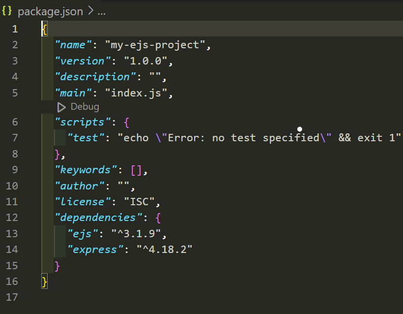
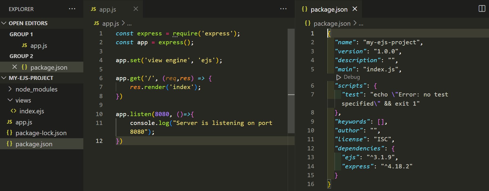

# EJS Installation

## Overview

In this section, we will guide beginners through the **installation process of EJS**. We will provide step-by-step instructions on how to install the necessary software and modules to get started with EJS. We will also explain the prerequisites for using EJS and provide helpful tips to ensure a smooth installation process.

👍By the end of this section, beginners will have a solid understanding of the software requirements for using EJS and will be able to successfully install EJS and its dependencies. Whether you are a web development novice or an experienced developer new to EJS, this section will provide a comprehensive guide to get you up and running with EJS quickly and easily.

## Prerequisites

???+Note
Please click on the name of the software to go to the official download website!

- Download [Node.js](https://nodejs.org/en).

- Download [VS Code](https://code.visualstudio.com/).

## Installation Steps for EJS

Follow these steps to install EJS.
At this point, you should have Node.js and VS Code installed on your local computer.

1. Create a new project directory.
      
      a. Open your terminal or command prompt.

      b. Move to your desktop by typing the following command: 
    ```py
    cd Desktop
    ```

      c. Create a new directory for your project by entering the following command:
    ```py
    mkdir my-ejs-project
    ```

2.  In your same terminal, navigate to the project directory by entering the following command in the terminal.
    ```py
    cd my-ejs-project
    ```

3.  In the terminal, run the following command to open your project directory in "Visual Studio Code".
    ```py
    code .
    ```

4. Once the "Visual Studio Code" is opened, open the console by pressing **ctrl+J** (Windows) or **BRIAN HERE** (Mac) to open the console.

5. Use the following command to install EJS using npm (Node Package Manager) in the console. This will create a "package.json" file in the project directory.

    ```py
    npm init -y
    ```

    

6.  Install Express module.

      a. Enter the following command in the terminal.

      b. This will install Express as a dependency for your project.
    ```py
    npm install express
    ```

7.  Install EJS module.

      a. Enter the following command in the terminal.

      b. This will install EJS as a dependency for your project.
    ```py
    npm install ejs
    ```

8. If you have successfully installed both npm and EJS, your "package.json" should show npm and EJS in "dependencies". 
    

9. Create a new file in you project directory named "app.js".

      a. This will serve as the main entry point for your application.

10.  Require the "express" module by adding the following line to the top of your "app.js".
    ```py
    const express = require(`express`);
    ```

11.  Create an instance of the Express application by adding the following line in your "app.js".
    ```py
    const app = express();
    ```

12. Set the view engine to EJS by adding the following line in your "app.js".
    ```py
    app.set(`view engine`,  `ejs`);
    ```

13. Create a route for your application by adding the following lines. This route will render a file named "index.ejs" located in the "views" directory. Now let's create this file!
    ```py
    app.get('/', (req, res) => {
          res.render('index');
    });
    ```

14. Create a "views" directory in your project directory.

15. Creae a new file in the "views" directory named "index.ejs".

16. Add this line to bottom of your "app.js" file.
```py
app.listen(8080, ()=>{
      console.log("Server is listening on port 8080");
})
```

???+Suceess
      Now you are ready to explore the dynamics of EJS!

???+Outcome
    


## EJS Tags

| Tag   | Description                                                         |
| ----- | ------------------------------------------------------------------- |
| `<%`  | Scriptlet' tag, for control-flow, no output                         |
| `<%_` | Whitespace Slurping' Scriptlet tag, strips all whitespace before it |
| `<%=` | Outputs the value into the template (escaped)                       |
| `<%-` | Outputs the unescaped value into the template                       |
| `<%#` | Comment tag, no execution, no output                                |
| `<%%` | Outputs a literal '<%'                                              |
| `%%>` | Outputs a literal '%>'                                              |
| `%>`  | Plain ending tag                                                    |
| `-%>` | Trim-mode ('newline slurp') tag, trims following newline            |
| `_%>` | Whitespace Slurping' ending tag, removes all whitespace after it    |

???+ Info
      It is recommended that you familiarize yourself with these tags before starting to use EJS.
