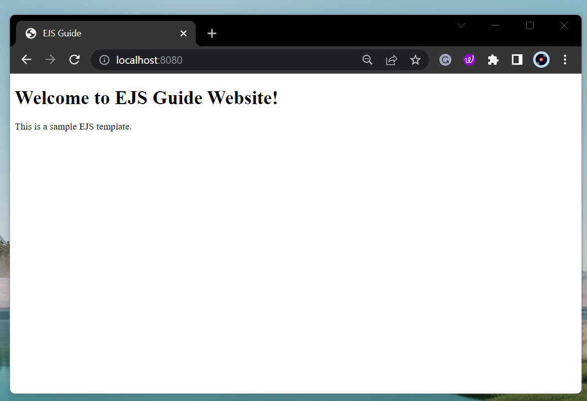

# Creating a basic EJS templates

???+ Recap
    If you're building a web application with Node.js and Express, EJS (Embedded JavaScript) is a powerful templating engine that you can use to generate HTML markup dynamically.

## What is CLI?

CLI is a command line program that accepts text input to execute operating system functions.
CLI stands for "Command Line Interface".

| Species                            | Description                                                                                 |
| ---------------------------------- | ------------------------------------------------------------------------------------------- |
| `-o / --output-file FILE`          | Write the rendered output to FILE rather than stdout.                                       |
| `-f / --data-file FILE`            | Must be JSON-formatted. Use parsed input from FILE as data for rendering.                   |
| `-i / --data-input STRING`         | Must be JSON-formatted and URI-encoded. Use parsed input from STRING as data for rendering. |
| `-m / --delimiter CHARACTER`       | Use CHARACTER with angle brackets for open/close (defaults to %).                           |
| `-p / --open-delimiter CHARACTER`  | Use CHARACTER instead of left angle bracket to open.                                        |
| `-c / --close-delimiter CHARACTER` | Use CHARACTER instead of right angle bracket to close.                                      |
| `-s / --strict`                    | When set to true, generated function is in strict mode.                                     |
| `-n / --no-with`                   | Use 'locals' object for vars rather than using with (implies --strict).                     |
| `-l / --locals-name`               | Name to use for the object storing local variables when not using with.                     |
| `-w / --rm-whitespace`             | Remove all safe-to-remove whitespace, including leading and trailing whitespace.            |
| `-d / --debug`                     | Outputs generated function body.                                                            |
| `-h / --help`                      | Display this help message.                                                                  |
| `-V/v / --version`                 | Display the EJS version.                                                                    |

## Create a basic EJS template

Inside of your "views" folder, you have your "index.ejs" file. This file will contain your EJS template.

Here's an example of a simple EJS template:

```
<!DOCTYPE html>
<html>
  <head>
    <title><%= data.title %></title>
  </head>
  <body>
    <h1><%= data.heading %></h1>
    <p><%= data.message %></p>
  </body>
</html>
```

In this template, there will be three EJS expressions:

- <%= data.title %> will display the value of the title variable.
- <%= data.heading %> will display the value of the heading variable.
- <%= data.message %> will display the value of the message variable.

???+Success
    You have created a basic EJS template. You can now use this template to generate HTML markup with plain JavaScript.

## Create Data to Pass to the Template

> One of the main benefits of using a templating language like EJS is the ability to pass data to the template. In order to display dynamic content on the web page, we need to pass data to the EJS template.

1. To do this, create an object with the data that you want to dynamically display in your HTML file in your "app.js" file. For example, let's create an object with a title, heading, and message.

2. Simply, copy and paste the following code in your "app.js" file.

```py
const data = {
  title: "EJS Guide",
  heading: "Welcome to EJS Guide Website!",
  message: "This is a sample EJS template.",
};
```

3. Now, pass in your data to ejs file by modifying your "app.get" function in you "app.js" file.

```py
app.get("/", (req, res) => {
  res.render("index", {data});
});
```

## One step before you run your first dynamic ejs file!

### Successful Outcome


Create a new file in your project folder called app.js. This file will contain the code to set up your Express.js app.

```js
const express = require("express");
const app = express();

const data = {
  title: "EJS Guide",
  heading: "Welcome to EJS Guide Website!",
  message: "This is a sample EJS template.",
};

app.set("view engine", "ejs");

app.get("/", (req, res) => {
  res.render("index", { data });
});

app.listen(8080, () => {
  console.log("Server is listening on port 8080");
});
```

In this code, we:

- `const express = require("express");`

    - This line imports the express module, which is a popular framework for building web applications in Node.js.

- `const app = express();`

    - This creates an instance of the express application.

- `const data = {
  title: "EJS Guide",
  heading: "Welcome to EJS Guide Website!",
  message: "This is a sample EJS template.",
};` 

    - This creates an object called data that contains some information that will be used to render a web page.

- `app.set("view engine", "ejs");`

    - This line tells the express application to use the EJS template engine for rendering views. EJS stands for Embedded JavaScript, which is a popular template language for building web pages.

- `app.get("/", (req, res) => {
  res.render("index", { data });
});`

    - This sets up a route handler for the root URL of the application ("/"). When a client requests this URL, the app.get() function will be called. This function takes two arguments: a callback function and an object. The callback function takes two arguments: req (short for "request") and res (short for "response"). The req object represents the HTTP request that the client sent, and the res object represents the HTTP response that the server will send back to the client.

    - Inside the callback function, the res.render() function is called, which tells express to render the "index" view using the data object we defined earlier. The "index" view is an EJS template that will be used to generate the HTML that will be sent back to the client.

- `app.listen(8080, () => {
  console.log("Server is listening on port 8080");
});`

    - This starts the express application and listens for incoming HTTP requests on port 8080. When the server starts up, it will log a message to the console to let you know that it's running.

## Start the server

In the terminal in your Visual Studio Code, run the following command to start the server:

```
node app.js
```

???+Success
    Now, visit "http://localhost:8080"

## Outcome


